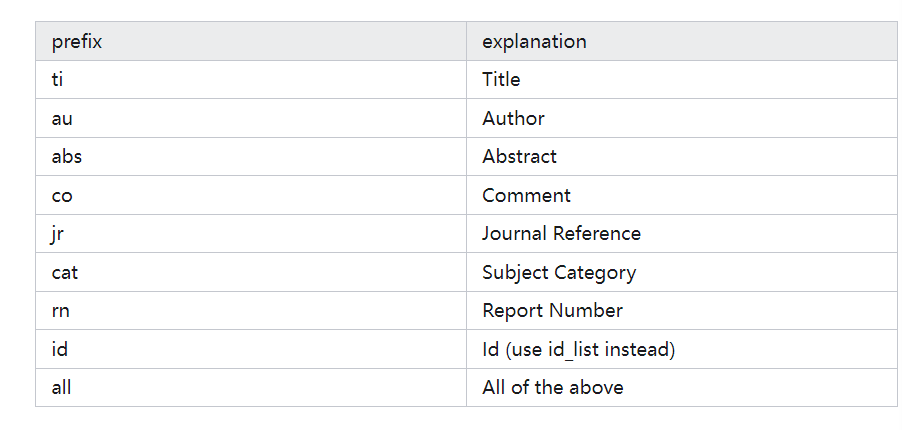
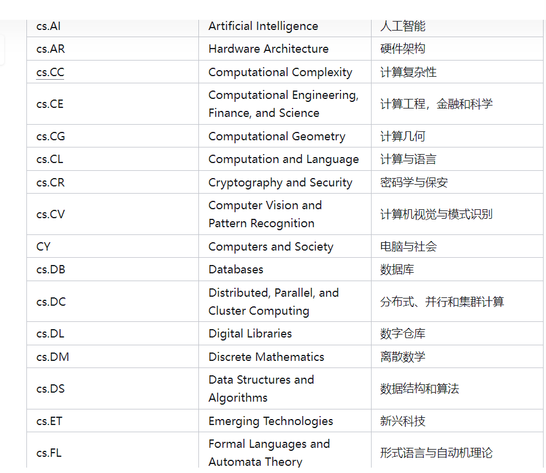
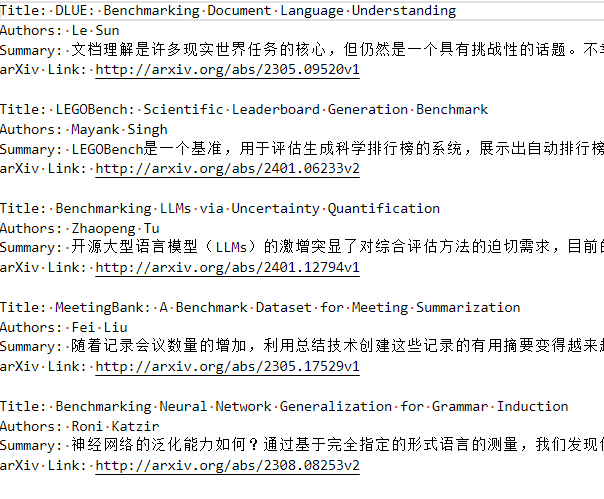

<div align="center">
    <h1>
        Arxiv_Paper_Assistant 
    </h1>
</div>

<div align=center>
    
</div>

************************
## 🚀 介绍(Introduce)

### 检索Arxiv中不同领域和技术的paper，并根据abstract使用gpt-3.5-turbo生成中文的一句话总结，帮助你更加快速地阅读arxiv上的最新论文，适用于超速地略读。
******************
## 📥 安装(installation)
```python
pip install arxiv-paper-assistant
```
或者 or
```bash
git clone https://github.com/flyingwaters/arxiv_paper_assistant.git
cd arxiv_paper_assistant
python setup.py install
```
*************************
## 💻 用法(usage)
```python
from arxiv_paper_assistant import open_ai_setting, search_in_arxiv

open_ai_setting(open_ai_key="open_ai_api_tokens", open_ai_base_url="https://openkey.cloud/v1" )

search_in_arxiv(query = 'ti:benchmark+AND+cat:cs.CL',
                start_time = "20230201",
                end_time = "",
                max_result = 10, 
                sort_order="ascending",
                output_name ="output.txt")
```
***************
##  🐶 说明

#### 推荐一篇arxiv api 的知乎文章 https://zhuanlan.zhihu.com/p/679538991

### 下面是一些计算机领域paper的检索方法
### <p style="color: blue;">1. Query 查询检索的关键词的作用域</p> 
<div align=center>
    
</div>

### <p style="color: blue;">2. 查询中cat: 域 计算机相关领域</p> 
<div align=center>
    
</div>

### <p style="color: blue;">3. 查询中cat: 域 计算机相关领域</p> 
<div align=center>
    
</div>

### <p style="color: blue;">4. output.txt 示例</p> 
<div align=center>
    
</div>

********************************

## <p style="color: red;"> 注意</p>
1. 如果未输入准确格式的日期，输入"", 另一个开始日期或者截止日期也会失效
2. 使用一段限定日期来检索paper时，注意max_result 不能超过10000，否则无法检索日期，自动从今日开始向前检索。

*************
## 🌈 Email: 
fly_fenglongyu@outlook.com

******************
##  ⭐许可证
Apache License Version 2.0, January 2004 http://www.apache.org/licenses/

